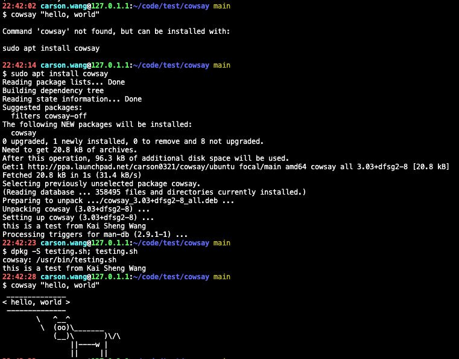
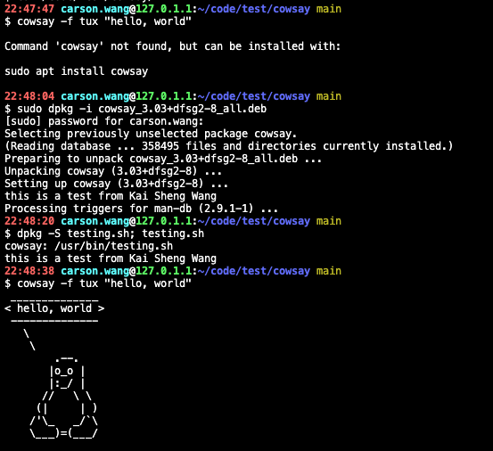

# Debian Package testing

## Environment

```bash
5.4.0-99-generic x86_64 GNU/Linux
Distributor ID: Ubuntu
Description:    Ubuntu 20.04.3 LTS
Release:        20.04
Codename:       focal
```

## Process

This task is based on Debian package concept, so I have to pick one existed Debian package to do an experiment. We can find it to download through [Ubuntu archive](https://packaging.ubuntu.com/), [Debian archive](https://www.debian.org/distrib/packages), or [GNU FTP website](https://ftp.gnu.org/) and so on. I choose [cowsay](https://packages.ubuntu.com/focal/cowsay) package to test it. To start with, we can use `apt source` command if we want to get its source code. [APT](https://en.wikipedia.org/wiki/APT_(software)) is a free-software user interface that works with core libraries to handle the installation and removal of software on Debian, and Debian-based Linux distribution. It is noteworthy that we have to add package source url into `/etc/apt/sources.list` or `/etc/apt/sources.list.d/`, but otherwise it's possible to be not found.

```bash
echo "deb-src http://cz.archive.ubuntu.com/ubuntu focal main universe" | sudo tee -a /etc/apt/sources.list
# echo "deb-src http://cz.archive.ubuntu.com/ubuntu focal main universe" | sudo tee -a /etc/apt/sources.list.d/cowsay.list
sudo apt update
apt source cowsay
```

The result is show below.

```bash
$ apt source cowsay
Reading package lists... Done
NOTICE: 'cowsay' packaging is maintained in the 'Git' version control system at:
https://salsa.debian.org/debian/cowsay.git
Please use:
git clone https://salsa.debian.org/debian/cowsay.git
to retrieve the latest (possibly unreleased) updates to the package.
Need to get 29.6 kB of source archives.
Get:1 http://cz.archive.ubuntu.com/ubuntu focal/universe cowsay 3.03+dfsg2-7 (dsc) [1,946 B]
Get:2 http://cz.archive.ubuntu.com/ubuntu focal/universe cowsay 3.03+dfsg2-7 (tar) [14.4 kB]
Get:3 http://cz.archive.ubuntu.com/ubuntu focal/universe cowsay 3.03+dfsg2-7 (diff) [13.3 kB]
Fetched 29.6 kB in 1s (25.1 kB/s)
dpkg-source: info: extracting cowsay in cowsay-3.03+dfsg2
dpkg-source: info: unpacking cowsay_3.03+dfsg2.orig.tar.gz
dpkg-source: info: unpacking cowsay_3.03+dfsg2-7.debian.tar.xz
dpkg-source: info: using patch list from debian/patches/series
dpkg-source: info: applying 00-fix_paths
dpkg-source: info: applying 01-empty_messages_fix
dpkg-source: info: applying 02-remove_trailing_spaces
dpkg-source: info: applying manpage
dpkg-source: info: applying elephants-in-snake_flip
dpkg-source: info: applying luke-koala_typo
dpkg-source: info: applying apt_cow
dpkg-source: info: applying calvin_cow
dpkg-source: info: applying cock_cow
dpkg-source: info: applying duck_cow
dpkg-source: info: applying gnu_cow
dpkg-source: info: applying mech-and-cow
dpkg-source: info: applying ponies_cow
dpkg-source: info: applying snowman_cow
dpkg-source: info: applying suse_cow
dpkg-source: info: applying utf8_width
dpkg-source: info: applying moofasa-tabs
dpkg-source: info: applying 03-ansi_code_width_color_widechar.patch
dpkg-source: info: applying kangaroo_cow
dpkg-source: info: applying fox_cow

$ ls -la
total 48
drwxrwxr-x  3 carson.wang carson.wang  4096 Feb 17 20:50 .
drwxrwxr-x 15 carson.wang carson.wang  4096 Feb 17 13:06 ..
drwxrwxr-x  5 carson.wang carson.wang  4096 Feb 17 20:50 cowsay-3.03+dfsg2
-rw-r--r--  1 carson.wang carson.wang 13272 Oct 30  2019 cowsay_3.03+dfsg2-7.debian.tar.xz
-rw-r--r--  1 carson.wang carson.wang  1946 Oct 30  2019 cowsay_3.03+dfsg2-7.dsc
-rw-r--r--  1 carson.wang carson.wang 14406 Dec 30  2016 cowsay_3.03+dfsg2.orig.tar.gz
```

We can also use other ways. For example, it's simple to get a source code of Debian package via [pull-lp-source](https://manpages.ubuntu.com/manpages/focal/man1/pull-lp-source.1.html) command.

```bash
# sudo apt install ubuntu-dev-tools
pull-lp-source cowsay focal
```

The result is show below. It's the same as the above.

```bash
$ pull-lp-source cowsay focal
Found cowsay 3.03+dfsg2-7 in focal
Valid signature by 0x9CF557FE13CB90CA2AEF1D2080D302F5886D839C
Downloading cowsay_3.03+dfsg2.orig.tar.gz from archive.ubuntu.com (0.014 MiB)
Downloading cowsay_3.03+dfsg2-7.debian.tar.xz from archive.ubuntu.com (0.013 MiB)
dpkg-source: info: extracting cowsay in cowsay-3.03+dfsg2
dpkg-source: info: unpacking cowsay_3.03+dfsg2.orig.tar.gz
dpkg-source: info: unpacking cowsay_3.03+dfsg2-7.debian.tar.xz
dpkg-source: info: using patch list from debian/patches/series
dpkg-source: info: applying 00-fix_paths
dpkg-source: info: applying 01-empty_messages_fix
dpkg-source: info: applying 02-remove_trailing_spaces
dpkg-source: info: applying manpage
dpkg-source: info: applying elephants-in-snake_flip
dpkg-source: info: applying luke-koala_typo
dpkg-source: info: applying apt_cow
dpkg-source: info: applying calvin_cow
dpkg-source: info: applying cock_cow
dpkg-source: info: applying duck_cow
dpkg-source: info: applying gnu_cow
dpkg-source: info: applying mech-and-cow
dpkg-source: info: applying ponies_cow
dpkg-source: info: applying snowman_cow
dpkg-source: info: applying suse_cow
dpkg-source: info: applying utf8_width
dpkg-source: info: applying moofasa-tabs
dpkg-source: info: applying 03-ansi_code_width_color_widechar.patch
dpkg-source: info: applying kangaroo_cow
dpkg-source: info: applying fox_cow

$ ls -la
total 48
drwxrwxr-x  3 carson.wang carson.wang  4096 Feb 17 20:49 .
drwxrwxr-x 15 carson.wang carson.wang  4096 Feb 17 13:06 ..
drwxrwxr-x  5 carson.wang carson.wang  4096 Feb 17 20:49 cowsay-3.03+dfsg2
-rw-rw-r--  1 carson.wang carson.wang 13272 Feb 17 20:49 cowsay_3.03+dfsg2-7.debian.tar.xz
-rw-rw-r--  1 carson.wang carson.wang  1946 Feb 17 20:49 cowsay_3.03+dfsg2-7.dsc
-rw-rw-r--  1 carson.wang carson.wang 14406 Feb 17 20:49 cowsay_3.03+dfsg2.orig.tar.gz
```

`*.orig.tar.gz` file is a upstream source. `*.debian.tar.xz` file is a custom source with the Debian changes. `*.dsc` file is meta data. Now, we can get cowsay source code with 3.03+dfsg2-7 version, and begin entering the directory of its source code to implement requirements. I write a simple script(`my_script.sh`) to generate related files automatically. In the following, I will explain its purpose step by step.

```bash
#!/bin/bash
cd cowsay-3.03+dfsg2/
echo -e '#!/bin/bash\nset -e\necho "this is a test from Kai Sheng Wang"\nexit 0' > testing.sh
echo "testing.sh usr/bin" >> debian/install
echo -e '#!/bin/bash\nset -e\nbash testing.sh\nexit 0' > debian/postinst
```

There're some commands. It uses `echo` command to new some file or modify file. The `echo` command with -e parameter means it enables interpretation of backslash escapes. And, the `>` symbol means it will overwrite the existing file if it exists. The `>>` means it will append to an existing file if it exists. It's fine to use text editor such as vim to modify it. For example, we can not only type `vim testing.sh` command to enter vim normal mode, but also type `i` to enter vim insert mode and modify something. Besides `testing.sh` file, there're two file who named debian/install and debian/postinst respectively. The `debian/install` file controls which files get installed where for this package. When installing successfully, it can print expected result using `dpkg -S testing.sh; testing.sh` command.

Moreover, the `debian/postinst` file is run after the installation of the package has completed. If we want to specify a result that runs prior to installing the contents of the package, we can create `debian/preinst`. Since it has to execute testing.sh to get expected result during the Debian package installation time, I use `debian/postinst` script to achieve this.

```bash
carson.wang@127.0.1.1:~/code/test/cowsay/cowsay-3.03+dfsg2 main
$ cat testing.sh
#!/bin/bash
set -e
echo "this is a test from Kai Sheng Wang"
exit 0

carson.wang@127.0.1.1:~/code/test/cowsay/cowsay-3.03+dfsg2 main
$ cat debian/install
testing.sh usr/bin

carson.wang@127.0.1.1:~/code/test/cowsay/cowsay-3.03+dfsg2 main
$ cat debian/postinst
#!/bin/bash
set -e
bash testing.sh
exit 0
```

Although this source code has modified, we have to type `dch -i` to increase the Debian release number and add a new changelog entry before packing this. After adding a new changelog entry, we must also type `dpkg-source --commit` to generate a patch corresponding to the local changes. If there's no patch, it will failed to automate the build activity around executing the `dpkg-buildpackage` command package further with the `debuild` command. The `debuild` command with `-us -uc` paramters means it doesn't sign with gpg key to autobuild this package. It will also  generates `*.change`, `*.build`, `*.buildinfo` and `.deb` until the command is done.

```bash
$ head -10 debian/changelog
cowsay (3.03+dfsg2-8) focal; urgency=medium

  * This is Carson's cowsay testing package

 -- carson.wang <kiki86151@hotmail.com>  Thu, 17 Feb 2022 21:08:25 +0800

cowsay (3.03+dfsg2-7) unstable; urgency=medium

  * New maintainer (closes: #910035)
  * Fix lintian warning about spelling of 'balloons' in patch

$ dpkg-source --commit
dpkg-source: info: using patch list from debian/patches/series
dpkg-source: warning: executable mode 0775 of 'testing.sh' will not be represented in diff
dpkg-source: info: local changes detected, the modified files are:
 cowsay-3.03+dfsg2/testing.sh
Enter the desired patch name: carson-test
dpkg-source: info: local changes have been recorded in a new patch: cowsay-3.03+dfsg2/debian/patches/carson-test

$ cat debian/patches/carson-test
Description: This is Carson's cowsay testing package
Origin: vendor, <url of original patch>
Bug: <url in upstream bugtracker>
Bug-Debian: https://bugs.debian.org/<bugnumber>
Bug-Ubuntu: https://launchpad.net/bugs/<bugnumber>
Forwarded: no
Reviewed-By: <name and email of someone who approved the patch>
Last-Update: 2022-02-17

--- /dev/null
+++ cowsay-3.03+dfsg2/testing.sh
@@ -0,0 +1,4 @@
+#!/bin/bash
+set -e
+echo "this is a test from Kai Sheng Wang"
+exit 0

$ debuild -us -uc
 dpkg-buildpackage -us -uc -ui
dpkg-buildpackage: info: source package cowsay
dpkg-buildpackage: info: source version 3.03+dfsg2-8
dpkg-buildpackage: info: source distribution focal
dpkg-buildpackage: info: source changed by carson.wang <kiki86151@hotmail.com>
 dpkg-source --before-build .
dpkg-buildpackage: info: host architecture amd64
 fakeroot debian/rules clean
dh clean
   dh_clean
 dpkg-source -b .
dpkg-source: info: using source format '3.0 (quilt)'
dpkg-source: info: building cowsay using existing ./cowsay_3.03+dfsg2.orig.tar.gz
dpkg-source: info: using patch list from debian/patches/series
dpkg-source: info: building cowsay in cowsay_3.03+dfsg2-8.debian.tar.xz
dpkg-source: info: building cowsay in cowsay_3.03+dfsg2-8.dsc
 debian/rules build
dh build
   dh_update_autotools_config
   dh_autoreconf
   create-stamp debian/debhelper-build-stamp
 fakeroot debian/rules binary
dh binary
   dh_testroot
   dh_prep
   debian/rules override_dh_auto_install
make[1]: Entering directory '/home/carson.wang/code/test/cowsay/cowsay-3.03+dfsg2'
install -D /home/carson.wang/code/test/cowsay/cowsay-3.03+dfsg2/cowsay /home/carson.wang/code/test/cowsay/cowsay-3.03+dfsg2/debian/cowsay/usr/games/cowsay
install -d /home/carson.wang/code/test/cowsay/cowsay-3.03+dfsg2/debian/cowsay/usr/share/cowsay
cp -a /home/carson.wang/code/test/cowsay/cowsay-3.03+dfsg2/cows /home/carson.wang/code/test/cowsay/cowsay-3.03+dfsg2/debian/cowsay/usr/share/cowsay
install -d /home/carson.wang/code/test/cowsay/cowsay-3.03+dfsg2/debian/cowsay-off/usr/share/cowsay/cows
mv /home/carson.wang/code/test/cowsay/cowsay-3.03+dfsg2/debian/cowsay/usr/share/cowsay/cows/bong.cow /home/carson.wang/code/test/cowsay/cowsay-3.03+dfsg2/debian/cowsay/usr/share/cowsay/cows/beavis.zen.cow /home/carson.wang/code/test/cowsay/cowsay-3.03+dfsg2/debian/cows
ay/usr/share/cowsay/cows/mutilated.cow /home/carson.wang/code/test/cowsay/cowsay-3.03+dfsg2/debian/cowsay-off/usr/share/cowsay/cows
rm /home/carson.wang/code/test/cowsay/cowsay-3.03+dfsg2/debian/cowsay/usr/share/cowsay/cows/mech-and-cow
rm /home/carson.wang/code/test/cowsay/cowsay-3.03+dfsg2/debian/cowsay/usr/share/cowsay/cows/head-in.cow
make[1]: Leaving directory '/home/carson.wang/code/test/cowsay/cowsay-3.03+dfsg2'
   dh_install
   dh_installdocs
   dh_installchangelogs
   dh_installexamples
   dh_installman
   dh_perl
   dh_link
   dh_strip_nondeterminism
   dh_compress
   dh_fixperms
   dh_missing
   dh_installdeb
   dh_gencontrol
   dh_md5sums
   dh_builddeb
dpkg-deb: building package 'cowsay-off' in '../cowsay-off_3.03+dfsg2-8_all.deb'.
dpkg-deb: building package 'cowsay' in '../cowsay_3.03+dfsg2-8_all.deb'.
 dpkg-genbuildinfo
Can't stat /usr/local/etc: No such file or directory
 at /usr/share/perl5/Dpkg/Vendor/Debian.pm line 469.
 dpkg-genchanges  >../cowsay_3.03+dfsg2-8_amd64.changes
dpkg-genchanges: info: not including original source code in upload
 dpkg-source --after-build .
dpkg-buildpackage: info: binary and diff upload (original source NOT included)
Now running lintian cowsay_3.03+dfsg2-8_amd64.changes ...
W: cowsay: binary-without-manpage usr/bin/testing.sh
W: cowsay source: debian-watch-file-missing-version
W: cowsay source: maintainer-script-lacks-debhelper-token debian/hello.postinst
W: cowsay source: maintainer-script-lacks-debhelper-token debian/postinst
W: cowsay: package-section-games-but-has-usr-bin
W: cowsay: script-with-language-extension usr/bin/testing.sh
Finished running lintian.
```

Finally, we use `debuild -us -uc -S` command to generate source-only files (`*_source.changes`), and `debsign -k MY_GPG_KEY *_source.changes` to sign gpg key with dsc, buildinfo, changes files in order to upload modified source code to PPA. When finishing these steps, we can type `dput ppa:<USER_ID>/<PPA_REPO> *_source.changes` command to upload, and afterwards we have to wait for PPA's email. If the result is accepted and the status sets "published", we can type `sudo add-apt-repository ppa:<USER_ID>/<PPA_REPO>`, `sudo apt update`, `sudo apt install` to install this modified package.

```bash
$ debuild -us -uc -S
 dpkg-buildpackage -us -uc -ui -S
dpkg-buildpackage: info: source package cowsay
dpkg-buildpackage: info: source version 3.03+dfsg2-8
dpkg-buildpackage: info: source distribution focal
dpkg-buildpackage: info: source changed by carson.wang <kiki86151@hotmail.com>
 dpkg-source --before-build .
 fakeroot debian/rules clean
dh clean
   dh_clean
 dpkg-source -b .
dpkg-source: info: using source format '3.0 (quilt)'
dpkg-source: info: building cowsay using existing ./cowsay_3.03+dfsg2.orig.tar.gz
dpkg-source: info: using patch list from debian/patches/series
dpkg-source: info: building cowsay in cowsay_3.03+dfsg2-8.debian.tar.xz
dpkg-source: info: building cowsay in cowsay_3.03+dfsg2-8.dsc
 dpkg-genbuildinfo --build=source
Can't stat /usr/local/etc: No such file or directory
 at /usr/share/perl5/Dpkg/Vendor/Debian.pm line 469.
 dpkg-genchanges --build=source >../cowsay_3.03+dfsg2-8_source.changes
dpkg-genchanges: info: not including original source code in upload
 dpkg-source --after-build .
dpkg-buildpackage: info: binary and diff upload (original source NOT included)
Now running lintian cowsay_3.03+dfsg2-8_source.changes ...
W: cowsay source: debian-watch-file-missing-version
W: cowsay source: maintainer-script-lacks-debhelper-token debian/postinst
Finished running lintian.


$ debsign -k MY_GPG_KEY ./cowsay_3.03+dfsg2-8_source.changes
 signfile dsc cowsay_3.03+dfsg2-8.dsc MY_GPG_KEY

 fixup_buildinfo cowsay_3.03+dfsg2-8.dsc cowsay_3.03+dfsg2-8_source.buildinfo
 signfile buildinfo cowsay_3.03+dfsg2-8_source.buildinfo MY_GPG_KEY

 fixup_changes dsc cowsay_3.03+dfsg2-8.dsc ./cowsay_3.03+dfsg2-8_source.changes
 fixup_changes buildinfo cowsay_3.03+dfsg2-8_source.buildinfo ./cowsay_3.03+dfsg2-8_source.changes
 signfile changes ./cowsay_3.03+dfsg2-8_source.changes MY_GPG_KEY

Successfully signed dsc, buildinfo, changes files


$ dput ppa:carson0321/cowsay ./cowsay_3.03+dfsg2-8_source.changes
Checking signature on .changes
gpg: ./cowsay_3.03+dfsg2-8_source.changes: Valid signature from XXXXXXXXXXXXXXX
Checking signature on .dsc
gpg: ./cowsay_3.03+dfsg2-8.dsc: Valid signature from XXXXXXXXXXXXXXX
Uploading to ppa (via ftp to ppa.launchpad.net):
  Uploading cowsay_3.03+dfsg2-8.dsc: done.
  Uploading cowsay_3.03+dfsg2-8.debian.tar.xz: done.  
  Uploading cowsay_3.03+dfsg2-8_source.buildinfo: done.
  Uploading cowsay_3.03+dfsg2-8_source.changes: done.
Successfully uploaded packages.
```

## Result





## Referense

* [Ubuntu packaging guide](https://packaging.ubuntu.com/html/)
  * [fixing-a-bug.html](https://packaging.ubuntu.com/html/fixing-a-bug.html)
* [Debian Developer Documentation](https://www.debian.org/doc/devel-manuals)
  * [Debian Policy](https://www.debian.org/doc/debian-policy/ch-maintainerscripts.html)
  * [Debian Maintainers Guide](https://www.debian.org/doc/manuals/debmake-doc/index.en.html)
  * [Developers Reference](https://www.debian.org/doc/manuals/developers-reference/pkgs.en.html)
  * [Packaging Tutorial](https://www.debian.org/doc/manuals/packaging-tutorial/packaging-tutorial.en.pdf)
* [PPA](https://help.launchpad.net/Packaging/PPA)
  * [BuildingASourcePackage](https://help.launchpad.net/Packaging/PPA/BuildingASourcePackage)
  * [ImportingYourPGPKey](https://help.launchpad.net/YourAccount/ImportingYourPGPKey)
  * [Uploading](https://help.launchpad.net/Packaging/PPA/Uploading)
  * [InstallingSoftware](https://help.launchpad.net/Packaging/PPA/InstallingSoftware)
* [Ubuntu GnuPrivacyGuardHowto](https://help.ubuntu.com/community/GnuPrivacyGuardHowto)
